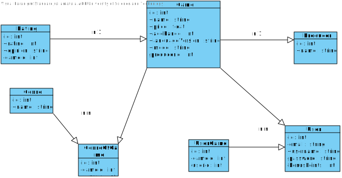

# Projekt realizowany na przedmiocie Inżynieria Internetu
>Na przedmiocie Inżynieria Internetu zrealizowany został projekt dwuosobowy oparty na architekturze REST.

| Nazwisko i imię | Wydział | Kierunek | Semestr | Grupa | Rok akademicki |
| :-------------: | :-----: | :------: | :-----: | :---: | :------------: |
| Urszula Piątek         | WIMiIP  | IS       |   2     | 3     | 2020/2021      |
| Julia Matuła         | WIMiIP  | IS       |   2     | 3    | 2020/2021      |

## Projekt 
Tematem  naszego projektu był *Sklep z grami komputerowymi* . W celu zobrazowania funkcjonalności bazy stworzony został diagram za pomocą programu **Visual Paradigm**.  



Aplikacja została napisana w języku **JavaScript** w środowisku programistycznym **WebStorm**.  Do stworzenia bazy wykorzystaliśmy **SQLite**.  Testowanie aplikacji wykonywane było za pomocą **Postman**.

## Implementacja 
* poprawnie skonfigurowany routing
* utworzenie relacyjnej bazy danych 
```
static relationMappings={
     ratingGame: {
        relation: Model.BelongsToOneRelation,
        modelClass: require('./game.model'),
         join:{
                from: 'Rating.gameId',
                to: 'Game.id'
         }
     }
    };
```
* stworzenie walidacji danych
```
function checkGameParams(gameName, price, ageRange, languageVersion, mode) {
    if (gameName === "") throw new EmptyInputException("Game name");
    if (price < 0) throw new IncorrectInputException("Price cannot be a negative number");
    if (ageRange < 0) throw new IncorrectInputException("Age range cannot be a negative number");
    if (languageVersion === "") throw new EmptyInputException("Language version");
    if  (mode !== "singleplayer") {
        if (mode !== "multiplayer") throw new IncorrectInputException("Game mode can only be single- or multi- player");
    }
}
```
* możliwość rejestracji z  uwierzytelnieniem za pomocą **JWT**
* obsługa wyjątków 
```
class GenreNotFoundException extends Error {
     constructor(message) {
         super(message || "Genre not found");
         this.status = 404
     }
 }
module.exports = GenreNotFoundException;
```

## Przykładowe funkcjonalności 
1. Games
* wyświetlenie wszystkich gier
* dodanie gry
* usunięcie gry 

2. Genre
* wyświetlenie wszystkich gatunków 
* dodanie nowego gatunku 
* aktualizacja gatunku o konkretnym id 

3.  Producer 
* dodanie nowego producenta gry 
* aktualizacja nazwy producenta o konkretnym id
* usunięcie producenta 

4. Rating
* aktualizacja oceny 
* dodanie oceny do istniejącej gry
* usunięcie oceny 

5. User
* możliwość rejestracji i logowania
* aktualizacja nazwy użytkonwnika bądź maila
* wyświetlenie wszystich informacji  o użytkowniku 


